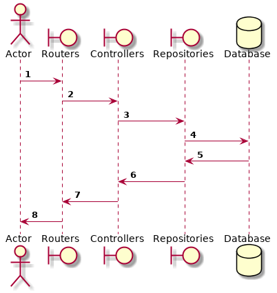
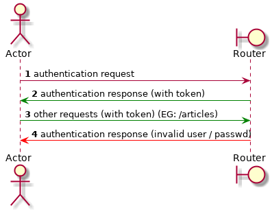

# Express API boilerplate
    Express.Js starter kit / boilerplate with Babel, hot reloading, testing, linting and a working example app built in. In the following lines we're trying to make clear how this solution works & some decisons around it. Hope it helps :-)

## How it was built?
    In a nutshell, this is an API build with Express.js, the authentication is done using [PassportJS](http://www.passportjs.org), it's using Swagger (OpenAPI 3.0), Jest & Supertest for testing, SonarQube for code quality, Docker containers for development & deployment & Heroku for deployment.

### Installing dependencies & start the solution

#### Prerequisites

1. You need to have installed the LTS version of NodeJS. We recomend using NVM to install it (https://github.com/nvm-sh/nvm). After you've installed NVM, install the latest NodeJS LTS version using the command 
```console
~$ nvm install --lts
```

2. We are using yarn instead of npm, so you need to install also yarn. (https://yarnpkg.com/en/)

#### Solution dependencies

The solution is using nodemon for automatically reloading the server while there's any change in the source code.

```console
~$ yarn install
~$ yarn start
```

The server starts listening for connections on port 8080, so if you open a browser & head t(http://localhost:8080/api/v1/explorer/) you'll get the Swagger file rendered in the browser.

## Writing & running tests

```console
~$ yarn run test
~$ yarn run test:cover [with coverage]
```

When running the tests with code coverage the result of the coverage will be find in folder `/coverage/lcov-report/index.html`. Keep in mind that `./coverage/lcov.info` file is being used also by SonarQube for showing the code coverage in the SonarQube report. 

## Linting code

We're using ESLint in the solution and the base style is 'airbnb'. To show all the lint errors in the solution just run the command below.

```console
~$ yarn run lint
```

## Static code analysis

For checking the code quality of the solution we're using [SonarQube](https://www.sonarqube.org/). As there's no CI pipeline at this time, we're running the sonar scanner manually (running `./start-sonar-scanner.sh`) The settings for SonarQube can be found in `sonar-project.properties` file.

## Solution architecture

As you can see in the following "flow diagram" the user requests are being passed from Routers to the Database & back, and in some cases we store images / send push notifications to the users devices. Right now the solution is using MongoDB as a database, but that can be changed easily thanks to [Repository pattern](https://www.martinfowler.com/eaaCatalog/repository.html).
Flow diagram



Authentication diagram

As you can see in the following diagram, for authenticating users we're using JWT Web Tokens. The middlware used is [Passport.JS](http://www.passportjs.org/).



The diagrams were created using [PlantUml](plantuml.com). There's an VSCode extension available & you'll need to have GraphViz installed in order to see them in VSCode.

## Docker & Heroku

### Build the image for docker & wake it up

You need to have docker installed & running.

```console
~$ [sudo] docker build -t marketapp .
~$ [sudo] docker-compose up
```

### Build the image for heroku and deploy

```console
~$ [sudo] heroku container:push web
~$ heroku container:release web
```

## External links

1. [Swagger link](http://swagger.io) - Is an tool in which one can define the API Schema, & generate both client & server applications based on the schema.
2. [Open api converter](http://openapi-converter.herokuapp.com) - If you need to convert Swagger 2.0 files to OpenAPI 3.0 files.
3. [Bearer authentication](https://swagger.io/docs/specification/authentication/bearer-authentication/) - How the bearer authentication works.

